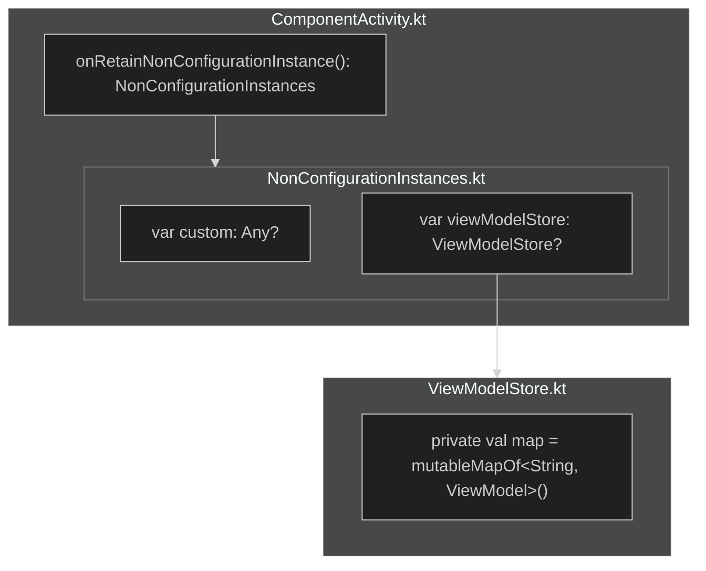
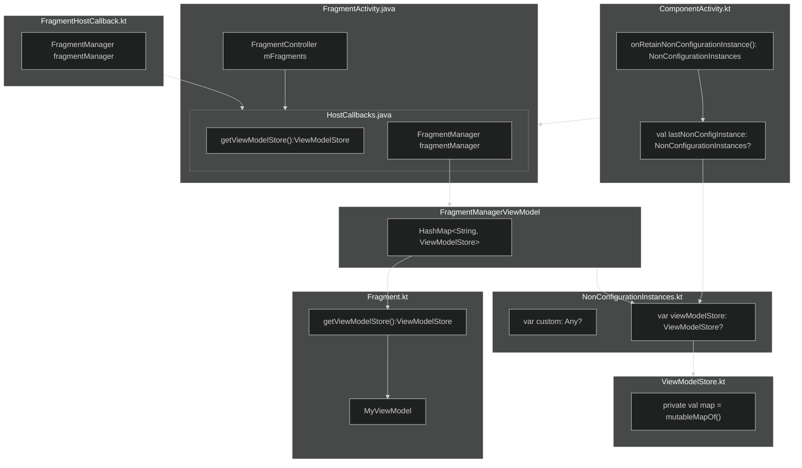
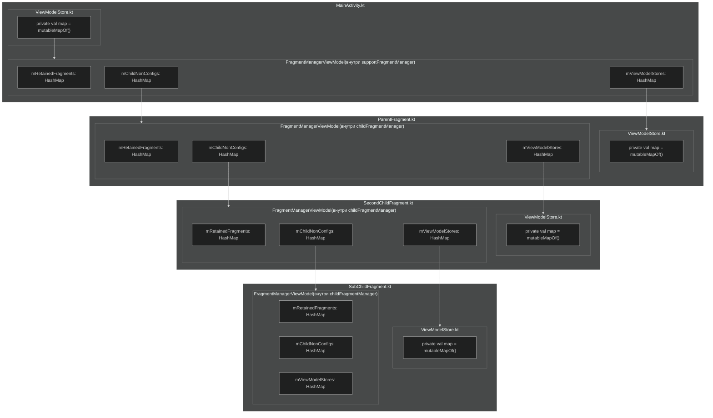

# ViewModel Under The Hood: Saved State Handle

В предыдущей статье мы рассмотрели [ViewModelStore](view-model-under-the-hood-store.md) и изучили полный путь от
создания
`ViewModel` до его хранения в `ViewModelStore`. Мы выяснили, где хранится сам `ViewModelStore`, но рассматривали
это в контексте `ComponentActivity` и его родителя `Activity`.

А как обстоят дела у `Fragment`-ов? В этой статье мы ответим на вопрос:

**Где хранятся `ViewModelStore` для `Fragment`-ов и как `Retain`-фрагменты переживают изменение конфигурации?**

## Вводная

**ViewModelStore** — это класс, который содержит внутри себя коллекцию `Map<String, ViewModel>`.  
ViewModel-и хранятся в этой коллекции по ключу, а `ViewModelStoreOwner` - в лице `Fragment`, `ComponentActivity` и
`NavBackStackEntry` может очистить их при необходимости.

**Fragment(Фрагменты)** — это части UI, которые могут жить внутри активности или в другом фрагменте, обеспечивая
гибкость и
переиспользуемость интерфейса. Фрагменты управляются активностью и её жизненным циклом, а навигация часто строится на
базе фрагментов с использованием подхода `SingleActivity`. Прямые наследники — `DialogFragment`,
`BottomSheetDialogFragment` и
`AppCompatDialogFragment` — используются для отображения диалогов и нижних листов.

**Retain Fragment**_(~~@Deprecated~~)_ — это фрагмент, который сохраняется при изменении конфигурации активности,  
вместо того чтобы пересоздаваться. Это достигается вызовом метода `setRetainInstance(true)` у Fragment,
который указывает системе **не уничтожать фрагмент** при пересоздании активности.

Раньше механизм Retain Fragment использовался для хранения данных и фоновых операций, так как если жив фрагмент, то живы
все его данные.
Но сейчас он считается устаревшим и не
рекомендуется к использованию. В современных приложениях его заменяет `ViewModel`.

---

## Как сохраняется ViewModelStore у Fragment?

В этой статье я рассчитываю, что вы уже ознакомились со статьей
[ViewModelStore](view-model-under-the-hood-store.md).

В предыдущей статье мы **детально** рассмотрели процесс сохранения `ViewModelStore` для `Activity`.  
Цепочка вызовов содержала все шаги до конечной точки `ActivityThread` и даже выше.

Однако в случае `Fragment`-ов цепочка вызовов к счастью **короче** и проще.  
Поэтому мы рассмотрим сохранение `ViewModelStore` для `Fragment` и `Retain Fragment` отталкиваясь от следующей
диаграммы и дополним ее для Fragment-ов:



Начнём работу с фрагментами. В этой статье мы не будем углубляться в работу `FragmentManager` и транзакциями — вместо
этого сосредоточимся на том, **где и как хранятся `ViewModel` и `ViewModelStore`** в случае с фрагментами.

Как мы знаем, фрагменты не существуют сами по себе — они запускаются внутри **активити** или даже **внутри других
фрагментов**.

Рассмотрим простой пример `Activity`, которая добавляет фрагмент в контейнер(FrameLayout):

```kotlin
class MainActivity : AppCompatActivity() {

    override fun onCreate(savedInstanceState: Bundle?) {
        ...
        supportFragmentManager
            .beginTransaction()
            .add(R.id.frameLayoutContainer, FirstFragment())
            .commit()
    }
}
```

> **Важно:** Код в статье предназначен исключительно для демонстрации и **не претендует на best practices**. Примеры
> упрощены для лучшего понимания.

Теперь имея Activity и транзакцию создадим сам фрагмент и инициализируем в нём `ViewModel` стандартным способ:

```kotlin
class FirstFragment : Fragment() {

    private lateinit var viewModel: MyViewModel
    ...
    override fun onViewCreated(view: View, savedInstanceState: Bundle?) {
        super.onViewCreated(view, savedInstanceState)

        viewModel = ViewModelProvider.create(owner = this).get(MyViewModel::class)
    }
}
```

Здесь, как и в предыдущих примерах (в прошлой статье), используется `ViewModelProvider.create`, который требует в
качестве параметра **`owner`**. Это означает, что класс `Fragment` должен реализовывать некий интерфейс, позволяющий ему
выступать в роли владельца
`ViewModel`. Таким интерфейсом является `ViewModelStoreOwner`, который реализуют такие классы, как `Fragment`,
`ComponentActivity` и
`NavBackStackEntry`.

В исходном коде метода `create` у `ViewModelProvider` явно требуется именно этот интерфейс. Поскольку
`ViewModelProvider` был переписан для KMP, его `expect`-объявление находится в `commonMain`:

```kotlin
public expect class ViewModelProvider {
    ....
    public companion object {
        public fun create(
            owner: ViewModelStoreOwner,
            factory: Factory = ViewModelProviders.getDefaultFactory(owner),
            extras: CreationExtras = ViewModelProviders.getDefaultCreationExtras(owner),
        ): ViewModelProvider
    }
}
```

Раз мы это выяснили, давайте сразу посмотрим, как **`Fragment`** реализует интерфейс `ViewModelStoreOwner`.  
Это важно, потому что такие классы, как `DialogFragment`, `BottomSheetDialogFragment`, `AppCompatDialogFragment` —
наследуются от `Fragment`, и среди них только он реализует этот интерфейс:

```java

@NonNull
@Override
public ViewModelStore getViewModelStore() {
    if (mFragmentManager == null) {
        throw new IllegalStateException("Can't access ViewModels from detached fragment");
    }
    if (getMinimumMaxLifecycleState() == Lifecycle.State.INITIALIZED.ordinal()) {
        throw new IllegalStateException("Calling getViewModelStore() before a Fragment "
                + "reaches onCreate() when using setMaxLifecycle(INITIALIZED) is not "
                + "supported");
    }
    return mFragmentManager.getViewModelStore(this);
}
```

Как видим, фрагмент для получения своего `ViewModelStore` обращается к `FragmentManager` и запрашивает у него нужный
ViewModelStore, передавая **самого себя** в качестве ключа:

```java
...
        return mFragmentManager.getViewModelStore(this);
...
```

<tip>

**Напоминание:**

`FragmentManager` — это основной компонент, управляющий фрагментами. Он управляет их стеком и позволяет добавлять
фрагменты в back stack.
</tip>

Далее нас интересует метод `getViewModelStore`, который есть у класса `FragmentManager.java`:

```java

@NonNull
ViewModelStore getViewModelStore(@NonNull Fragment f) {
    return mNonConfig.getViewModelStore(f);
}
```

Оказывается, тут есть ещё один вложенный вызов: у объекта `mNonConfig` вызывается метод `getViewModelStore`, куда
передаётся фрагмент в качестве ключа. Давайте посмотрим, что это за объект `mNonConfig`:

```java
private FragmentManagerViewModel mNonConfig;
```

Вот это интересно: `FragmentManager` использует свою **ViewModel**, чтобы хранить информацию о `ViewModelStore`
фрагментов которые он запускал.  
И это логично — ведь ему нужно как-то сохранять состояние фрагментов и их ViewModel-и при изменениях конфигурации.

Итак, мы выяснили следующий стек вызовов (по порядку):

1. `ViewModelProvider.create(owner = this).get(MyViewModel::class)`
2. `Fragment.getViewModelStore()`
3. `FragmentManager.getViewModelStore(fragment)`
4. `FragmentManagerViewModel.getViewModelStore(fragment)`

**Поэтому дальше нас будет интересовать класс `FragmentManagerViewModel`.**
Свой путь начнем с его вызова метода `FragmentManagerViewModel.getViewModelStore(fragment)`:

**FragmentManagerViewModel.java:**

```java
final class FragmentManagerViewModel extends ViewModel {
    ...

    @NonNull
    ViewModelStore getViewModelStore(@NonNull Fragment f) {
        ViewModelStore viewModelStore = mViewModelStores.get(f.mWho);
        if (viewModelStore == null) {
            viewModelStore = new ViewModelStore();
            mViewModelStores.put(f.mWho, viewModelStore);
        }
        return viewModelStore;
    }
    ...
}
```

Как это работает?  
Внутри `FragmentManagerViewModel` есть коллекция `HashMap<String, ViewModelStore>()`, которая хранит `ViewModelStore`
для каждого фрагмента, принадлежащего `FragmentManager`'у.  
То есть все фрагменты, которые были добавлены с помощью `FragmentManager`'а — при попытке получить `ViewModelStore`,
сначала ищут его по ключу (`f.mWho`).

Если `ViewModelStore` не найден — это означает, что фрагмент впервые внутри себя создает `ViewModel`, и, соответственно,
впервые ему требуется `ViewModelStore`.  
В этом случае `ViewModelStore` создается и помещается в HashMap `mViewModelStores`.

```java
final class FragmentManagerViewModel extends ViewModel {
    ...
    private final HashMap<String, Fragment> mRetainedFragments = new HashMap<>();
    private final HashMap<String, FragmentManagerViewModel> mChildNonConfigs = new HashMap<>();
    private final HashMap<String, ViewModelStore> mViewModelStores = new HashMap<>();
    ...
}
```

<tip>

**`mViewModelStores`** — это `HashMap`, в которой хранятся `ViewModelStore` всех фрагментов, находящихся *
*внутри `Activity` или вложенных в родительский фрагмент**.  
Каждый `ViewModelStore` связан с конкретным фрагментом по его уникальному ключу (`fragment.mWho`) и используется для
хранения `ViewModel`, привязанных к жизненному циклу соответствующего фрагмента.
</tip>

Что нам известно в данный момент?  
Когда мы создаем `ViewModel` внутри нашего `Fragment`'а, то его `ViewModelStore` хранится внутри `FragmentManager`,
точнее — внутри его `ViewModel`'ки (`FragmentManagerViewModel`).

Вроде бы всё ясно: наша `ViewModel` хранится внутри `ViewModelStore`, который сам хранится внутри
`FragmentManagerViewModel` (который тоже является `ViewModel`).  
И тут возникает логичный вопрос — **а где хранится сам `FragmentManagerViewModel`?**  
Он ведь тоже `ViewModel`, а значит должен храниться внутри какого-то `ViewModelStore`.

Краткий ответ: он хранится внутри `ViewModelStore`, который принадлежит самой `Activity`.

**Хочешь убедиться? Тогда читай дальше.**

Чтобы ответить на наш вопрос, начнём с основ — с того, как работают фрагменты и откуда берётся `FragmentManager`.
Но перед этим давайте взглянем на иерархию всех существующих видов Activity, чтобы понять, с какой цепочки мы начнём
работу:

**Иерархия Activity**:

```
Activity
└── ComponentActivity
    └── FragmentActivity
        └── AppCompatActivity
```

| Класс               | Назначение                                                                                                             |
|---------------------|------------------------------------------------------------------------------------------------------------------------|
| `Activity`          | Базовый низкоуровневый класс экрана в Android SDK. Напрямую использовать не рекомендуется.                             |
| `ComponentActivity` | Современная основа для Jetpack компонентов: `ViewModel`, `SavedState`, `ActivityResult API`, `OnBackPressedDispatcher` |
| `FragmentActivity`  | Добавляет поддержку фрагментов (через AndroidX). Фрагменты из `android.app.Fragment` больше не поддерживаются.         |
| `AppCompatActivity` | Поддержка старых версий Android c `Deprecated Api`, `AppCompatDelegate` `ActionBar`, тем `AppCompat`, `Material UI`, . |

Как вы наверняка догадались, нас будет интересовать именно `FragmentActivity`.
`FragmentActivity` — это базовый класс, предоставляющий интеграцию с системой фрагментов. Именно он отвечает за создание
и управление `FragmentManager`. На его основе построен и более часто используемый `AppCompatActivity`, который расширяет
функциональность за счёт поддержки компонентов из библиотеки поддержки (AppCompat).

Именно `FragmentActivity` (или его наследник `AppCompatActivity`) позволяет полноценно работать с фрагментами и
`FragmentManager`. Остальные способы взаимодействия с фрагментами считаются устаревшими.

Рассмотрим исходный код `FragmentActivity`:

**FragmentActivity.java**

```java
public class FragmentActivity extends ComponentActivity {
    ...
    final FragmentController mFragments = FragmentController.createController(new HostCallbacks());

    class HostCallbacks extends FragmentHostCallback<FragmentActivity> implements ViewModelStoreOwner {
        ...

        public ViewModelStore getViewModelStore() {
            return FragmentActivity.this.getViewModelStore();
        }
        ...
    }
    ...
}
```

> `HostCallbacks` реализует множество интерфейсов помимо `ViewModelStoreOwner`, но в статье они опущены, чтобы не
> отвлекать от сути.

Мы видим переменную `mFragments`, которая имеет тип `FragmentController`.  
Этой переменной присваивается результат вызова статического метода `createController`, куда передаётся новый экземпляр
`HostCallbacks()`.

`HostCallbacks` — это класс, реализующий интерфейс `ViewModelStoreOwner`. В своём методе `getViewModelStore()` он
возвращает `ViewModelStore`, принадлежащий самому `FragmentActivity`.

Кроме того, `HostCallbacks` наследуется от класса `FragmentHostCallback`, который выглядит следующим образом:

```kotlin
@Suppress("deprecation")
abstract class FragmentHostCallback<H> internal constructor(
    ...
) : FragmentContainer() {

    @get:RestrictTo(RestrictTo.Scope.LIBRARY)
    val fragmentManager: FragmentManager = FragmentManagerImpl()
    ...
}
```

<tip>  
`FragmentHostCallback` был переписан с Java на Kotlin, начиная с версии `androidx.fragment:fragment:*:1.7.0-beta01`.  
</tip>

Внутри `FragmentHostCallback` создаётся объект `FragmentManager`. Зная это, возвращаемся к исходникам
`FragmentActivity`,  
где есть поле `mFragments`:

```java
    final FragmentController mFragments = FragmentController.createController(new HostCallbacks());
```

Здесь создаётся объект `HostCallbacks`, который наследуется от `FragmentHostCallback` и реализует интерфейс  
`ViewModelStoreOwner`, в конечном итоге возвращая `ViewModelStore`, принадлежащий самой активности.

Посмотрим на исходники статического метода `FragmentController.createController()`:

```java
public class FragmentController {

    private final FragmentHostCallback<?> mHost;

    /**
     * Returns a {@link FragmentController}.
     */
    @NonNull
    public static FragmentController createController(@NonNull FragmentHostCallback<?> callbacks) {
        return new FragmentController(checkNotNull(callbacks, "callbacks == null"));
    }

    private FragmentController(FragmentHostCallback<?> callbacks) {
        mHost = callbacks;
    }

}
```

Мы видим, что внутри `FragmentActivity` создаётся `FragmentController` посредством вызова метода `createController()`.  
Метод принимает объект `FragmentHostCallback` — в нашем случае это подкласс `HostCallbacks`, который реализует
`ViewModelStoreOwner` и предоставляет `ViewModelStore` самой активности.

Чтобы лучше понять цепочку создания и передачи зависимостей, посмотрим на схему:

```
FragmentActivity
    └── Has a → FragmentController (mFragments)
           └── Created with → HostCallbacks
                   ├── Implements → ViewModelStoreOwner (delegates to FragmentActivity)
                   └── Extends → FragmentHostCallback
                            └── Has a → FragmentManagerImpl (as fragmentManager)
```

Эта структура позволяет `FragmentActivity` делегировать управление фрагментами специальному помощнику —
`FragmentController`.  
Таким образом, `FragmentActivity` не занимается напрямую логикой работы с фрагментами, но при этом сохраняет доступ к
ключевым компонентам: `FragmentManager` и `ViewModelStore`, благодаря вспомогательному классу `HostCallbacks`.

Теперь давайте подробнее рассмотрим, как создаётся и инициализируется `FragmentController`. Обратим внимание на
следующую строку:

```java
final FragmentController mFragments = FragmentController.createController(new HostCallbacks());
```

Здесь создаётся экземпляр `FragmentController`, которому в качестве параметра передаётся объект `HostCallbacks`. Именно
этот объект предоставляет необходимые зависимости, такие как `FragmentManager`.

Далее обратимся к конструктору `FragmentActivity`. В нём вызывается метод `init`, внутри которого регистрируется
слушатель `OnContextAvailableListener`. Этот слушатель срабатывает, когда контекст становится доступен, и в этот момент
вызывается метод `attachHost` у `FragmentController`:

**FragmentActivity.java:**

```java
public class FragmentActivity extends ComponentActivity {
    ...
    final FragmentController mFragments = FragmentController.createController(new HostCallbacks());

    public FragmentActivity() {
        super();
        init();
    }

    private void init() {
        ...
        addOnContextAvailableListener(context -> mFragments.attachHost(null /*parent*/));
    }
}
```

Теперь заглянем внутрь самого метода `attachHost`, который реализован в классе `FragmentController`.

**FragmentController.java:**

```java
/**
 * Attaches the host to the FragmentManager for this controller. The host must be
 * attached before the FragmentManager can be used to manage Fragments.
 */
public void attachHost(@Nullable Fragment parent) {
    mHost.getFragmentManager().attachController(
            mHost, mHost /*container*/, parent);
}
```

Внутри этого метода вызывается `getFragmentManager()` у переменной `mHost`. Эта переменная представляет собой объект
типа `FragmentHostCallback<?>`, а если точнее, то передается именно его наследник - объект `HostCallbacks`. Получив
`FragmentManager`, у него вызывается метод `attachController`, которому передаются: сам `HostCallbacks` как хост, он же
как контейнер, и опционально — родительский фрагмент (в данном случае `null`).

Сама переменная `mHost`, используемая внутри `FragmentController`, выглядит следующим образом:

**FragmentController.java:**

```java
private final FragmentHostCallback<?> mHost;
```

На этапе инициализации `FragmentActivity` создаётся экземпляр `FragmentController`, которому делегируется управление
фрагментами. Этот контроллер получает в конструктор объект `HostCallbacks`, обеспечивая тем самым связку между
`FragmentManager` и жизненным циклом активити.

Мы уже вскользь рассмотрели, как инициализируется эта переменная, но давай коротко повторим:

Класс `HostCallbacks` — это внутренний класс `FragmentActivity`, который наследуется от `FragmentHostCallback` и
одновременно реализует интерфейс `ViewModelStoreOwner`. Когда создаётся объект `FragmentController`, он получает в
качестве параметра экземпляр `HostCallbacks`. Этот объект сохраняется во внутреннем поле `mHost` типа
`FragmentHostCallback<?>`.

Поскольку `HostCallbacks` является потомком `FragmentHostCallback`, ему также доступны методы родителя — в частности,
`getFragmentManager()` (точнее, поле `fragmentManager`, полученное через геттер). В Java оно вызывается как
`getFragmentManager()`, хотя в Kotlin это просто свойство. Далее мы уже можем передавать `mHost` в методы
`FragmentManager`.

Теперь давай посмотрим, как именно `FragmentManager` получает доступ к `FragmentManagerViewModel`. Это происходит в
методе `attachController`, который вызывается внутри `FragmentManager`:

**FragmentManager.java:**

```java
void attachController(@NonNull FragmentHostCallback<?> host,
                      @NonNull FragmentContainer container, @Nullable final Fragment parent) {
    ...
    // Get the FragmentManagerViewModel
    if (parent != null) {
        mNonConfig = parent.mFragmentManager.getChildNonConfig(parent);
    } else if (host instanceof ViewModelStoreOwner) {
        ViewModelStore viewModelStore = ((ViewModelStoreOwner) host).getViewModelStore();
        mNonConfig = FragmentManagerViewModel.getInstance(viewModelStore);
    } else {
        mNonConfig = new FragmentManagerViewModel(false);
    }
    ...
}
```

<tip>  

**Цепочка инициализации:**  
**`FragmentActivity` → `HostCallbacks` → `FragmentManager` → `FragmentManagerViewModel`**

Эта последовательность отражает, как создаются и связываются между собой ключевые компоненты фреймворка фрагментов.
</tip>

Теперь разберём, что именно происходит внутри метода `attachController`:

---

##### 1. **Если `parent != null`**

Это означает, что мы имеем дело с **вложенными фрагментами**, которые управляются через `childFragmentManager`.  
В таком случае `FragmentManager` обращается к своему полю `mChildNonConfigs`, где хранятся `FragmentManagerViewModel`-ки
для вложенных фрагментов.  
Если нужной `FragmentManagerViewModel` ещё нет, она будет создана и сохранена в `HashMap`, используя идентификатор
родительского фрагмента в качестве ключа.

```java
private final HashMap<String, FragmentManagerViewModel> mChildNonConfigs = new HashMap<>();
```

---

##### 2. **Если `parent == null`, и `host instanceof ViewModelStoreOwner`**

Это основной путь при работе с `FragmentActivity` и `AppCompatActivity`, потому что `HostCallbacks` реализует
`ViewModelStoreOwner`.  
В этом случае `FragmentManager` получает `ViewModelStore`, привязанный к `FragmentActivity`, и передаёт его в
`FragmentManagerViewModel.getInstance()`.

Таким образом, `FragmentManagerViewModel` сохраняется в **том же `ViewModelStore`, что и остальные ViewModel-ки Activity
**, и будет жить столько же, сколько и сама `Activity`.

---

### 3. **Если `host` не реализует `ViewModelStoreOwner`**

Это **устаревший сценарий**, когда `Activity` напрямую наследуется от `Activity` или `ComponentActivity`, минуя
`FragmentActivity`/`AppCompatActivity`.

В этом случае `FragmentManager` создаёт `FragmentManagerViewModel` без использования `ViewModelStore`. Такая ViewModel
сохраняется через механизм `NonConfigurationInstances`, который Android применял до появления архитектурных компонентов.

Этот подход уже **не рекомендуется**, и с современными `androidx.fragment.app.Fragment` он **не работает**. Он применим
только для старых `android.app.Fragment` и только при активном флаге `setRetainInstance(true)`.

Отлично, ты уже собрал почти всю цепочку логики, и структура ясная. Давай я немного улучшу читаемость, сделаю переходы
чуть плавнее и кое-где уточню формулировки, не меняя сути. Вот улучшенная версия твоего блока:

---

Когда мы добавляем фрагмент в активити через `supportFragmentManager`, мы всегда попадаем под **второе условие**,
описанное выше:  
`host instanceof ViewModelStoreOwner`. В этой ситуации `FragmentManager` получает `ViewModelStore` у `host` (то есть
`FragmentActivity`) и передаёт его в метод `FragmentManagerViewModel.getInstance()`.

Внутри этого метода создаётся `FragmentManagerViewModel`, который сохраняется в `ViewModelStore`. Как мы уже говорили
ранее, этот `ViewModelStore` принадлежит `FragmentActivity` (или её наследнику `AppCompatActivity`).

**FragmentManagerViewModel.java:**

```java

@NonNull
static FragmentManagerViewModel getInstance(ViewModelStore viewModelStore) {
    ViewModelProvider viewModelProvider = new ViewModelProvider(viewModelStore, FACTORY);
    return viewModelProvider.get(FragmentManagerViewModel.class);
}
```

---

Теперь соберём **всю цепочку шагов**, которая выполняется при создании `ViewModel` внутри фрагмента:

```kotlin
viewmodel = ViewModelProvider(owner = this).get(MyViewModel::class)
```

1. `ViewModelProvider` запрашивает у `ViewModelStoreOwner` его `ViewModelStore`.  
   В данном случае `owner = this`, и это фрагмент.

2. У фрагмента вызывается `getViewModelStore()`, поскольку он реализует интерфейс `ViewModelStoreOwner`.

3. Внутри `Fragment.getViewModelStore()` происходит обращение к `FragmentManager`, в котором зарегистрирован этот
   фрагмент.  
   Вызов: `FragmentManager.getViewModelStore(fragment)`.

4. `FragmentManager` делегирует дальше и обращается к своей ViewModel-ке — `FragmentManagerViewModel`.

5. Внутри `FragmentManagerViewModel.getViewModelStore(fragment)` происходит поиск `ViewModelStore` по `fragment.mWho` в
   `HashMap<String, ViewModelStore>`.

6. Если `ViewModelStore` уже есть, он возвращается. Если нет — создаётся новый, сохраняется в мапу и возвращается.

```scss
FragmentActivity
     │
     ▼
HostCallbacks (наследуетcя от FragmentHostCallback & ViewModelStoreOwner)
     │
     ▼
FragmentController
     │
     ▼
FragmentManager.attachController(...)
     │
     ├─ Если есть parent:Fragment → используем его childFragmentManager
     │
     └─ Если host is ViewModelStoreOwner → берём ViewModelStore из host (Activity)
               │
               ▼
      FragmentManagerViewModel (ViewModel, хранится в Activity's ViewModelStore)
               │
               ▼
    ┌─────────────────────────────────────────────┐
    │ HashMap<String, ViewModelStore>             │
    │ └─ ключ: fragment.mWho                      │
    │ └─ значение: ViewModelStore конкретного Fragment-а │
    └─────────────────────────────────────────────┘
               │
               ▼
     ViewModelProvider(fragment).get(MyViewModel::class)
```

---

В упрощённом виде, схема ниже иллюстрирует, как устроено взаимодействие между `Activity`, `FragmentManager` и
`ViewModelStore`.
Заметьте что это диаграмма продолжение диаграммы которая была в начале статьи

У нас есть `Activity`, которая наследуется от `FragmentActivity` (а чаще — от его расширенного потомка
`AppCompatActivity`). При создании `Activity` инициализируется `FragmentController`, которому передаётся
`FragmentHostCallback` — точнее, его наследник `HostCallbacks`.

`HostCallbacks` реализует интерфейс `ViewModelStoreOwner`, но при этом **не создаёт** новый `ViewModelStore`, а
возвращает уже существующий — тот, что принадлежит `Activity`.

Далее `FragmentController` прикрепляет `FragmentManager` к своему хосту (`Activity` или `ParentFragment`).
`FragmentManager` создаёт `FragmentManagerViewModel` и сохраняет его во `ViewModelStore`, предоставленном
`HostCallbacks`, то есть — в `ViewModelStore`, принадлежащем `Activity`.

Теперь, когда внутри `Activity` мы добавляем фрагмент через `supportFragmentManager`, инициализация `MyViewModel` во
фрагменте приводит к тому, что `ViewModelProvider` запрашивает у фрагмента его `ViewModelStore`.

Фрагмент, в свою очередь, обращается к своему `FragmentManager` — *"дай мой `ViewModelStore`"*. `FragmentManager`, имея
прямую ссылку на `FragmentManagerViewModel`, запрашивает у него `ViewModelStore` по ключу (обычно это `fragment.mWho`) —
и возвращает `ViewModelStore`, связанный с этим фрагментом.

Именно туда, в этот `ViewModelStore`, и будет помещён `MyViewModel`.

---



Наконец, давайте убедимся, что `FragmentManagerViewModel`, привязанный к `FragmentManager` активити, действительно
хранится внутри `ViewModelStore`, который принадлежит самой активити. Для этого в методе `onCreate()` можно залогировать
все ключи, содержащиеся в `viewModelStore` активити:

```kotlin
override fun onCreate(savedInstanceState: Bundle?) {
    super.onCreate(savedInstanceState)
    setContentView(R.layout.activity_main)

    supportFragmentManager
        .beginTransaction()
        .add(R.id.frameLayoutContainer, FirstFragment())
        .commit()

    Log.d("MainActivity", "onCreate: ${viewModelStore.keys()}")
    // Output: onCreate: [androidx.lifecycle.ViewModelProvider.DefaultKey:androidx.fragment.app.FragmentManagerViewModel]
}
```
*Скриншот: ключ FragmentManagerViewModel, зарегистрированный в ViewModelStore активити*  


На этом этапе мы полностью проследили весь флоу в случае, когда у нас есть `Activity`, поверх которой запускается
`Fragment`, и внутри этого фрагмента инициализируется `ViewModel`. Мы дошли до конечной точки — увидели, где именно
хранятся `ViewModel`-ы.

### Вложенные фрагменты и `childFragmentManager`

Остался один важный кейс — **вложенные фрагменты**. То есть ситуация, когда мы запускаем один `Fragment` внутри другого
с помощью `childFragmentManager`. До сих пор мы рассматривали только добавление фрагмента через `FragmentManager`
активити (`supportFragmentManager`).

Напомню, мы уже сталкивались с этим кейсом при разборе метода `attachController()`, в котором реализуется логика выбора
источника `FragmentManagerViewModel`.

**FragmentManager.java:**

```java
void attachController(@NonNull FragmentHostCallback<?> host,
                      @NonNull FragmentContainer container,
                      @Nullable final Fragment parent) {
    ...
    // Получение FragmentManagerViewModel
    if (parent != null) {
        mNonConfig = parent.mFragmentManager.getChildNonConfig(parent);
    } else if (host instanceof ViewModelStoreOwner) {
        ViewModelStore viewModelStore = ((ViewModelStoreOwner) host).getViewModelStore();
        mNonConfig = FragmentManagerViewModel.getInstance(viewModelStore);
    } else {
        mNonConfig = new FragmentManagerViewModel(false);
    }
    ...
}
```

В случае, когда мы добавляем фрагмент поверх другого фрагмента через `childFragmentManager`, создавая вложенность,
срабатывает первое условие, а именно — проверка `parent != null`. Ранее мы уже выяснили, в каких случаях это условие
выполняется, но для понимания продублируем ещё раз:

#### **Если `parent != null`**

Это означает, что мы имеем дело с **вложенными фрагментами**, которые управляются через `childFragmentManager`.  
В таком случае `FragmentManager` обращается к своему полю `mChildNonConfigs`, где хранятся `FragmentManagerViewModel`
для вложенных фрагментов.  
Если нужной `FragmentManagerViewModel` ещё нет, она создаётся и сохраняется в `HashMap`, используя `fragment.mWho`
родительского фрагмента в качестве ключа.

При таком кейсе `FragmentManager` обращается к `parent`, вызывает у него метод `getChildNonConfig`, и попадает в
следующий код:
**FragmentManager.java:**

```java

@NonNull
private FragmentManagerViewModel getChildNonConfig(@NonNull Fragment f) {
    return mNonConfig.getChildNonConfig(f);
}
```

Здесь `mNonConfig` — это `FragmentManagerViewModel`, привязанный к родительскому `FragmentManager`. У него вызывается
`getChildNonConfig(f)`, и происходит следующее в
**FragmentManagerViewModel.java**

```java
final class FragmentManagerViewModel extends ViewModel {

    private final HashMap<String, Fragment> mRetainedFragments = new HashMap<>();
    private final HashMap<String, FragmentManagerViewModel> mChildNonConfigs = new HashMap<>();
    private final HashMap<String, ViewModelStore> mViewModelStores = new HashMap<>();

    @NonNull
    FragmentManagerViewModel getChildNonConfig(@NonNull Fragment f) {
        FragmentManagerViewModel childNonConfig = mChildNonConfigs.get(f.mWho);
        if (childNonConfig == null) {
            childNonConfig = new FragmentManagerViewModel(mStateAutomaticallySaved);
            mChildNonConfigs.put(f.mWho, childNonConfig);
        }
        return childNonConfig;
    }
}
```

В этом методе мы пытаемся получить `FragmentManagerViewModel` для `childFragmentManager` родительского фрагмента, чтобы
у `childFragmentManager` была собственная `FragmentManagerViewModel`, в которой можно будет хранить `ViewModelStore`
всех фрагментов, которые будут запущены внутри `childFragmentManager`.

Если такого `FragmentManagerViewModel` ещё не существует, он создаётся, кладётся в `mChildNonConfigs`, и затем
возвращается обратно в метод `attachController`, где продолжает использоваться для инициализации `childFragmentManager`.

Отличный запрос. Вот как можно лаконично и понятно сформулировать это как завершение или рефлексивный блок — с
пояснением про дерево `FragmentManagerViewModel` и как оно строится:

---

### Как формируется дерево `FragmentManagerViewModel`

Чтобы понять полную картину, важно представить, как строится иерархия `FragmentManagerViewModel` в реальном приложении:

- В начале у нас есть `Activity`, у которой есть `FragmentManager` (чаще всего это `supportFragmentManager`).
- У этого `FragmentManager` создаётся собственный `FragmentManagerViewModel`. Он сохраняется внутри `ViewModelStore`,
  который принадлежит самой `Activity`.

Теперь, если мы добавляем фрагменты через `FragmentManager` который принадлежит `Activity`(`supportFragmentManager`), то
для каждого такого фрагмента будет создан свой `ViewModelStore`. Эти `ViewModelStore` будут храниться **внутри**
`FragmentManagerViewModel`, связанного с `FragmentManager` самой `Activity`, в поле
`FragmentManagerViewModel#mViewModelStores`:

```java
final class FragmentManagerViewModel extends ViewModel {
    ...
    private final HashMap<String, ViewModelStore> mViewModelStores = new HashMap<>();
    ...
}
```

Каждый такой фрагмент, в свою очередь, тоже имеет собственный `FragmentManager` — это `childFragmentManager`. Он
используется, если мы хотим внутри фрагмента запускать другие фрагменты (вложенность, локальный стек навигации).

- У `childFragmentManager` тоже должен быть свой `FragmentManagerViewModel`(как у всех `FragmentManager`-ов), чтобы он
  мог хранить `ViewModelStore` для
  фрагментов, запущенных внутри родительского фрагмента, то есть внутри него.
- Эти `FragmentManagerViewModel` хранятся в `mChildNonConfigs` — это `Map<String, FragmentManagerViewModel>` внутри
  `FragmentManagerViewModel` родителя.

Таким образом, формируется дерево:

- Корень — это `FragmentManagerViewModel`, привязанный к `FragmentManager` самой `Activity` и хранящийся в её
  `ViewModelStore`.
- Далее — `FragmentManagerViewModel` для каждого вложенного `childFragmentManager`, сохранённые внутри
  `mChildNonConfigs`.
- Это дерево может быть сколь угодно глубоким, повторяя структуру вложенности фрагментов в приложении. Каждый узел
  в этом дереве это `FragmentManagerViewModel`

Именно такая структура позволяет корректно управлять `ViewModel`, сохраняя их сквозь конфигурационные изменения и
обеспечивая жизненный цикл, привязанный к конкретному фрагменту.



Думаю, теперь весь флоу хранения `ViewModelStore` должен быть полностью понятен.

Если у нас есть `FragmentActivity` или `AppCompatActivity`, то у неё есть свой собственный `ViewModelStore`. Когда мы
добавляем фрагмент через её `FragmentManager`, для этого фрагмента создаётся отдельный `ViewModelStore`. Этот
`ViewModelStore` будет храниться внутри `FragmentManagerViewModel`, который, в свою очередь, лежит внутри
`ViewModelStore`, принадлежащего активности.

> `FragmentManagerViewModel` создаётся автоматически при инициализации `FragmentManager` и регистрируется как обычный
`ViewModel` в `ViewModelStoreOwner` (например, в активности). Он предназначен именно для хранения `ViewModelStore`-ов
> всех дочерних фрагментов.

Если мы добавим ещё один фрагмент на тот же уровень — всё повторится: новый `ViewModelStore` → в
`FragmentManagerViewModel` → в `ViewModelStore` активности.

Но фишка в том, что каждый фрагмент имеет свой `childFragmentManager`, то есть может быть контейнером для других
фрагментов. И `childFragmentManager`, как и любой `FragmentManager`, имеет свой `FragmentManagerViewModel`.

> При каждом вызове `getChildFragmentManager()` фреймворк создаёт или использует уже существующий
`FragmentManagerViewModel`. Это гарантирует, что даже при пересоздании фрагмента `ViewModelStore` вложенных фрагментов
> не теряется.

Это значит: при добавлении вложенных фрагментов, `ViewModelStore` каждого из них будет храниться во внутренней
`FragmentManagerViewModel`, принадлежащей `childFragmentManager` родительского фрагмента.

> Внутри `FragmentManagerViewModel` используются ключи `Fragment.mWho`, чтобы сохранить и потом правильно восстановить
> соответствие между `Fragment` и его `ViewModelStore`.

Чем глубже вложенность, тем больше разрастается дерево.

Например:

 ```
 Activity
 └── ParentFragment1
     └── ParentFragment2
         ├── ChildFragment1
         └── ChildFragment2
 ```

В таком дереве:

- `ChildFragment1` и `ChildFragment2` — их `ViewModelStore` хранятся в `FragmentManagerViewModel`, принадлежащем
  `childFragmentManager` `ParentFragment2`.
- `ParentFragment2` — его `ViewModelStore` хранится в `FragmentManagerViewModel`, принадлежащем `childFragmentManager`
  `ParentFragment1`.
- `ParentFragment1` — его `ViewModelStore` лежит в `FragmentManagerViewModel` от `supportFragmentManager` активности.
- А сама `FragmentManagerViewModel` из `supportFragmentManager` — хранится в `ViewModelStore` самой активности.

Такой флоу помогает сохранить `ViewModel` даже при сложной навигации и вложенности фрагментов.
> Зачем вся эта сложность? Такой флоу помогает сохранить ViewModel даже при сложной навигации и глубокой вложенности
> фрагментов. Такая структура сохраняет иерархию ViewModelStore, обеспечивая корректное восстановление ViewModel даже
> при
> пересоздании компонентов.


Вот твой текст с сохранённым тоном и стилем, но полностью выправленной грамматикой и пунктуацией:

---

Итак, мы рассмотрели весь флоу хранения `ViewModelStore` для фрагментов. Пора двигаться дальше, ведь тема
Retain-фрагментов осталась нераскрытой — поэтому переходим к следующей части статьи.

## Как Retain-фрагменты переживают изменение конфигурации?

Напоминаю ещё раз: Retain-фрагменты устарели довольно давно, и на практике их использование не рекомендуется. О них
хорошо помнят разработчики, которые ещё писали на Java — Retain-фрагменты существовали задолго до появления `ViewModel`.
Когда `ViewModel` стала стандартом, Retain-фрагменты официально объявили устаревшими.  
Но знать о них всё же полезно. Итак, начнём.

В начале статьи уже было дано определение Retain-фрагментам. А при разборе «внутренностей» FragmentManagerViewModel
внимательные глаза могли заметить нечто, связанное с Retain-фрагментами — а именно, вот этот блок кода, который
появлялся в статье уже не раз:

```java
final class FragmentManagerViewModel extends ViewModel {
    ...
    private final HashMap<String, Fragment> mRetainedFragments = new HashMap<>();
    private final HashMap<String, FragmentManagerViewModel> mChildNonConfigs = new HashMap<>();
    private final HashMap<String, ViewModelStore> mViewModelStores = new HashMap<>();
    ...
}
```

Здесь есть три поля. Два из них мы уже подробно разобрали:

- `mViewModelStores` — для хранения `ViewModelStore` на одном уровне в дереве,
- `mChildNonConfigs` — для хранения вложенных `FragmentManagerViewModel`, соответствующих дочерним фрагментам /
  `FragmentManager`.

Но вот поле, которому мы до сих пор не уделяли внимания — это самое верхнее: `mRetainedFragments`. Это коллекция, которая хранит фрагменты по ключу.  
Стоп… что? Фрагменты **внутри** `ViewModel`?! Именно так.

Все фрагменты, у которых установлен флаг `setRetainInstance(true)`, попадают именно туда.  
Заинтриговал? Тогда давай разбираться глубже.

Как создать Retain Fragment?  
Retain-фрагменты — это не какой-то отдельный класс, наследник `Fragment`. Это всё тот же старый добрый `Fragment`, но с активированным флагом `setRetainInstance`:

```kotlin
class MyFragment : Fragment() {

    override fun onCreate(savedInstanceState: Bundle?) {
        super.onCreate(savedInstanceState)
        setRetainInstance(true)
    }
}
```

> Так как Retain-фрагменты устарели, метод `setRetainInstance` также помечен аннотацией `@Deprecated`.

С этого момента наш фрагмент становится *Retain*, и он сможет пережить изменение конфигурации — по той же схеме, по которой выживают `ViewModel`.  
Как именно? Мы уже немного знаем, но всё же давай проследим путь целиком — от вызова `setRetainInstance()` до хранения внутри `FragmentManagerViewModel#mRetainedFragments`.

Для этого заглянем в исходники метода `setRetainInstance`:
**Fragment.java:**
```java
@Deprecated
public void setRetainInstance(boolean retain) {
    ...
    if (retain) {
        mFragmentManager.addRetainedFragment(this);
    } else {
        mFragmentManager.removeRetainedFragment(this);
    }
    ...
}
```
Логика простая: если флаг `retain` установлен в `true`, фрагмент передаётся в `FragmentManager` как *Retain* — через метод `addRetainedFragment`.  
Если `false` — наоборот, удаляется из списка Retain-фрагментов через `removeRetainedFragment`.

Давайте продолжим и заглянем в сам `FragmentManager` и рассмотрим метод его `addRetainedFragment`:

**FragmentManager.java**:

```java
void addRetainedFragment(@NonNull Fragment f) {
    mNonConfig.addRetainedFragment(f);
}
```

Как по старинке, метод передает управление на `mNonConfig`, который, как мы уже знаем, является экземпляром `FragmentManagerViewModel`.

**FragmentManager.java**:

```java
private FragmentManagerViewModel mNonConfig;
```

Теперь давайте взглянем на метод `addRetainedFragment` внутри `FragmentManagerViewModel`:

**FragmentManagerViewModel.java**:

```java
void addRetainedFragment(@NonNull Fragment fragment) {
    ...
    if (mRetainedFragments.containsKey(fragment.mWho)) {
        return;
    }
    mRetainedFragments.put(fragment.mWho, fragment);
    ...
}
```

Вот и все: мы разобрались, как фрагмент становится *Retain* и как его хранение работает в `FragmentManagerViewModel`.

Теперь рассмотрим метод удаления фрагмента из Retain-списка, который работает по аналогичному принципу — через тот же flow:
**Fragment -> FragmentManager -> FragmentManagerViewModel**:

**FragmentManagerViewModel.java**:

```java
void removeRetainedFragment(@NonNull Fragment fragment) {
    ...
    boolean removed = mRetainedFragments.remove(fragment.mWho) != null;
    ...
}
```

Осталось понять как же потом эти фрагменты восстанавливаются после изменения конфигураций, одного их хранения не достаточно
ведь их нужно обратно вернуть после того как Activity пересоздается, все фрагменты пересоздаются, FragmentManager тоже, но Retain фрагменты
не должны пересоздаваться, а должны браться из `mRetainedFragments`, мы уже в начале статьи видели метод attachController у `FragmentManager`:
```java
    @SuppressLint("SyntheticAccessor")
    void attachController(@NonNull FragmentHostCallback<?> host,
            @NonNull FragmentContainer container, @Nullable final Fragment parent) {

    ...

    if (savedInstanceState != null) {
        restoreSaveStateInternal(savedInstanceState);
    }
    ...
}
```
Видим что идет обращение к методу restoreSaveStateInternal:
```java
void restoreSaveStateInternal(@Nullable Parcelable state) {
    ...
    Bundle bundle = (Bundle) state;
    ...
    FragmentManagerState fms = bundle.getParcelable(FRAGMENT_MANAGER_STATE_KEY);
    ...

    for (String who : fms.mActive) {
        ...
        Fragment retainedFragment = mNonConfig.findRetainedFragmentByWho(fs.mWho);
        ...
        mFragmentStore.makeActive(fragmentStateManager);
        ...
    }
}
```

Нас интересует это строка, очередное обращение к `mNonConfig`:
```java
Fragment retainedFragment = mNonConfig.findRetainedFragmentByWho(fs.mWho);
```
Вот и сам метод findRetainedFragmentByWho внутри FragmentManagerViewModel:
```java
    @Nullable
    Fragment findRetainedFragmentByWho(String who) {
        return mRetainedFragments.get(who);
    }
```