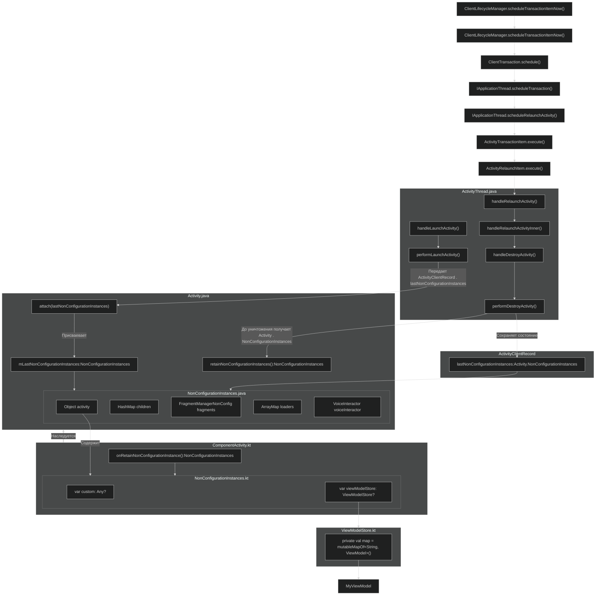

# ViewModel Under The Hood: View Model Store


## Введение

В статье не рассматривается работа с ViewModel, предполагается, что эта тема уже знакома. Основное внимание уделяется
тому, как ViewModel переживает изменение конфигурации. Но для начала — небольшое введение в ViewModel.

**ViewModel** - компонент архитектурного паттерна MVVM, который был предоставлен Google как примитив
позволяющий пережить изменение конфигураций. Изменение конфигураций в свою очередь - это состояние, заставляющая
activity/fragment пересоздаваться, это именно то состояние которое может пережить ViewModel.
Популярные конфигурации которые приводят к пересозданию Activity:

1. Изменение ориентаций экрана(screenOrientation): portrait/landscape
2. Изменение направления экрана(layoutDirection): rtl/ltr
3. Изменение языка приложения(locale)
4. Изменение размера шрифтов/соотношение экрана

Есть конечно способ сообщать системе о том что пересоздавать Activity при изменении конфигураций не нужно.
Флаг `android:configChanges` используется в `AndroidManifest.xml` в теге `<activity/>`, чтобы указать, какие изменения
конфигурации система не должна пересоздавать Activity, а передавать управление методу
`Activity.onConfigurationChanged()`.

```xml

<activity
        android:name="MainActivity"
        android:configChanges="layoutDirection|touchscreen|density|orientation|keyboard|locale|keyboardHidden|navigation|screenLayout|mcc|mnc|fontScale|uiMode|screenSize|smallestScreenSize"
/>
```

Однако сейчас речь не об этом. Наша цель — разобраться, каким образом `ViewModel` умудряется переживать все изменения
конфигурации и сохранять своё состояние.

## Объявление ViewModel

С появлением делегатов в Kotlin разработчики получили возможность значительно упростить создание и использование
компонентов. Теперь объявление `ViewModel` с использованием делегатов выглядит следующим образом:

```kotlin
class MainActivity : ComponentActivity() {

    private val viewModel by viewModel<MyViewModel>()
}
```

Без делегатов создание объекта ViewModel, используя явный вызов ViewModelProvider выглядит следующий образом:

```kotlin
class MainActivity : ComponentActivity() {

    private lateinit var viewModel: MyViewModel

    override fun onCreate(savedInstanceState: Bundle?) {
        super.onCreate(savedInstanceState)

        // В старых версиях ViewModelProvider был частью lifecycle-viewmodel
        viewModel = ViewModelProvider(this).get(MyViewModel::class.java)

        // После адаптации ViewModel под KMP и переноса ViewModelProvider в lifecycle-viewmodel-android 
        // можно и рекомендуется через перегруженный фабричный метод create:
        viewModel = ViewModelProvider.create(owner = this).get(MyViewModel::class)

        // Альтернативный способ создания ViewModel (эквивалентен предыдущему)
        viewModel = ViewModelProvider.create(store = this.viewModelStore).get(MyViewModel::class)
    }
}
```

Метод `ViewModelProvider.create` имеет параметры со значениями по умолчанию, поэтому на уровне байткода компилятор
создаст несколько перегруженных версий метода (overloads). Это позволяет вызывать его с разным количеством аргументов:
только с `store`, с `store` и `factory`, либо со всеми параметрами, включая `extras`.
<note>

**Jetpack ViewModel** теперь поддерживает **Kotlin Multiplatform (KMP)**, что позволяет использовать его
не только на Android, но и на iOS, Desktop и Web. Это стало возможным благодаря разделению на два модуля:

**lifecycle-viewmodel(expected):** KMP-модуль без привязки к Android.
**lifecycle-viewmodel-android(actual):** модуль для работы с ViewModelStoreOwner и ViewModelProvider на Android.

Начиная с версии **2.8.0-alpha03**, артефакты **lifecycle-*** теперь официально поддерживают Kotlin Multiplatform!
Это означает, что классы, такие как ViewModel, ViewModelStore, ViewModelStoreOwner и ViewModelProvider,
теперь можно использовать в общем коде.
</note>

<tip>
Далее в статье мы рассмотрим именно версию viewmodel:2.8.0+, если в версий на которой вы находитесь сейчас
немного отличаются исходники, то не переживайте, c добавлением поддержки kmp немного поменяли внутренюю  структуру ,
но реализация и внутренняя логика такая же что и до поддержки kmp
</tip>

## ViewModelStoreOwner ?

Как мы видим выше, мы вручную не создаём объект ViewModel, а только передаём тип его класса в ViewModelProvider, который
самостоятельно занимается созданием экземпляра.

Обратите внимание, что мы также передаём в метод
`ViewModelProvider.create` параметр `owner = this`. Если заглянуть в исходники метода **create**, можно заметить, что
требуется
тип owner: ViewModelStoreOwner:

```kotlin
public actual companion object {

    @JvmStatic
    @Suppress("MissingJvmstatic")
    public actual fun create(
        owner: ViewModelStoreOwner, // <- нас интересует этот тип
        factory: Factory,
        extras: CreationExtras,
    ): ViewModelProvider = ViewModelProvider(owner.viewModelStore, factory, extras)
}
```

<tip>
Если интересно, почему метод `create()` можно вызывать без передачи значений для параметров `factory` и `extras` (хоть они и обязательны):

```kotlin
ViewModelProvider.create(owner = this)
```

Это связано с тем, что код использует KMP (Kotlin Multiplatform). В expect-объявлении для create() уже заданы значения
по умолчанию для factory и extras, поэтому передавать их явно необязательно.

```kotlin
public expect class ViewModelProvider {
    ....
    public companion object {
        public fun create(
            owner: ViewModelStoreOwner,
            factory: Factory = ViewModelProviders.getDefaultFactory(owner),
            extras: CreationExtras = ViewModelProviders.getDefaultCreationExtras(owner),
        ): ViewModelProvider

    }
    ....
}
```

Подробнее можно посмотреть в исходниках:
[ViewModelProvider.kt](https://github.com/androidx/androidx/blob/androidx-main/lifecycle/lifecycle-viewmodel/src/commonMain/kotlin/androidx/lifecycle/ViewModelProvider.kt)
</tip>

### Углубляемся в ViewModelStore / Owner

Получается что при вызове метода `ViewModelProvider.create()` для параметра `owner` мы передаем `this` (само активити),
и как можно догадаться, это означает, что activity реализует(наследуется) от интерфейса `ViewModelStoreOwner`.
Давайте взглянем на исходники этого интерфейса:
[ViewModelStoreOwner](https://github.com/androidx/androidx/blob/androidx-main/lifecycle/lifecycle-viewmodel/src/commonMain/kotlin/androidx/lifecycle/ViewModelStoreOwner.kt):

```kotlin
public interface [[[ViewModelStoreOwner |https://github.com/androidx/androidx/blob/androidx-main/lifecycle/lifecycle-viewmodel/src/commonMain/kotlin/androidx/lifecycle/ViewModelProvider.kt]]] {

/**
 * The owned [ViewModelStore]
 */
public val viewModelStore: ViewModelStore
}
```

`ViewModelStoreOwner` — это интерфейс с единственным полем, которое представляет собой `ViewModelStore` (хранитель view
models). От `ViewModelStoreOwner` наследуются такие компоненты как: **ComponentActivity**, **Fragment**, *
*NavBackStackEntry**.

Официальная документация гласит:
> A scope that owns ViewModelStore.
> A responsibility of an implementation of this interface is to retain owned ViewModelStore during the configuration
> changes and call ViewModelStore. clear, when this scope is going to be destroyed.


------------------------------------------------------------------------------------------------

### Обязанности ViewModelStoreOwner: {id="123"}

1. **Хранение ViewModelStore во время изменения конфигураций.**
2. **Очистка ViewModelStore при уничтожении ComponentActivity/Fragment** — в состоянии `onDestroy()`. Удаляются все
   ViewModel-и
   которые ViewModelStore хранить в себе.

Мы определили, что ViewModelStoreOwner — это всего лишь интерфейс, не содержащий собственной логики.
Его реализуют такие компоненты, как:

- **`ComponentActivity`** (_и его наследники: `FragmentActivity, AppCompatActivity`_)
- **`Fragment`** (_и его производные: `DialogFragment`, `BottomSheetDialogFragment`, `AppCompatDialogFragment`_).
- **`NavBackStackEntry`** - Класс из библиотеки Jetpack Navigation (он же androidx navigation)

__________________________________________________________________________________________________________________________________________

Далее нас уже интересует сам ViewModelStore:

ViewModelStore — это класс, который внутри себя делегирует управление коллекцией Map (LinkedHashMap) для хранения
ViewModel по ключу:

```kotlin
private val map = mutableMapOf<String, ViewModel>()
```

По умолчанию в качестве ключа используется полное имя класса (включая его пакет). Этот ключ генерируется следующим
образом в исходниках утилитного класса ViewModelProviders (не путать с ViewModelProvider):

```kotlin
private const val VIEW_MODEL_PROVIDER_DEFAULT_KEY: String = "androidx.lifecycle.ViewModelProvider.DefaultKey"

internal fun <T : ViewModel> getDefaultKey(modelClass: KClass<T>): String {
    return "$VIEW_MODEL_PROVIDER_DEFAULT_KEY:$modelClass.canonicalName"
}
```

Таким образом, для MyViewModel ключ будет выглядеть так:
_`androidx.lifecycle.ViewModelProvider.DefaultKey:com.example.MyViewModel`_.

Поскольку ViewModelStore основан на `Map`, он делегирует все основные операции, такие как `put, get, keys и clear`,
внутреннему Map (_LinkedHashMap_).

Соответственно, так как внутренняя реализация `ViewModelStore` полагается на Map, он также делегирует свои методы `put`,
`get`, `key`, `clear` внутреннему `Map`(_LinkedHashMap_).
Особого внимания заслуживает метод `clear()`:

````kotlin
public open class ViewModelStore {

    private val map = mutableMapOf<String, ViewModel>()
    ...
    /**
     * Clears internal storage and notifies `ViewModel`s that they are no longer used.
     */
    public fun clear() {
        for (vm in map.values) {
            vm.clear()
        }
        map.clear()
    }
}
````

Давайте разберёмся, что здесь происходит. Когда наш `ViewModelStoreOwner` (в лице `ComponentActivity` или `Fragment`)
окончательно умирает (смерть не связана с пересозданием из-за изменения конфигураций), он вызывает метод `clear()` у
`ViewModelStore`.

В методе `clear()` цикл `for` проходит по всем значениям (`view models`), которые хранятся внутри внутреннего `HashMap`,
и вызывает у каждой `ViewModel` внутренний метод `clear()`. Этот метод, в свою очередь, инициирует вызов метода
`onCleared()` у нашей `ViewModel`.

`onCleared()` — это метод, который мы можем переопределить в своей `ViewModel`, и он вызывается только в момент
окончательного уничтожения `ViewModel`, когда активити или фрагмент также окончательно завершают свою работу.

```kotlin
public actual abstract class ViewModel {
    ...
    protected actual open fun onCleared() {} // <- метод onCleared, который можно переопределить

    @MainThread
    internal actual fun clear() {
        impl?.clear()
        onCleared() // <- вызов метода onCleared
    }
}
```

Таким образом, метод `clear()` гарантирует, что все ресурсы и фоновые задачи, связанные с `ViewModel`, будут корректно
освобождены перед уничтожением.
Соответственно, сам метод `viewModelStore.clear()` вызывается `ViewModelStoreOwner` (в лице `ComponentActivity` или
`Fragment`).  
Давайте в качестве примера выберем `ComponentActivity`, чтобы понять, как работает очистка.

Ниже приведён фрагмент кода из `ComponentActivity`, который отслеживает её уничтожение и вызывает
`viewModelStore.clear()`:

```kotlin
@Suppress("LeakingThis")
lifecycle.addObserver(
    LifecycleEventObserver { _, event ->
        if (event == Lifecycle.Event.ON_DESTROY) { // <- состояние ON_DESTROY является триггером
            // Clear out the available context
            contextAwareHelper.clearAvailableContext()
            // And clear the ViewModelStore 
            if (!isChangingConfigurations) { // <- проверка на то можно ли очищать ViewModelStore
                viewModelStore.clear()      // <- очистка ViewModelStore
            }
            reportFullyDrawnExecutor.activityDestroyed()
        }
    }
)
```

В данном коде происходит добавление наблюдателя на жизненный цикл активности с использованием `LifecycleEventObserver`.
Когда активность достигает состояния `ON_DESTROY`, запускается проверка, не происходит ли изменение конфигурации (
`isChangingConfigurations`).
Если активность действительно умирает окончательно (и не пересоздаётся), вызывается метод `viewModelStore.clear()`,
который очищает все связанные с активностью `ViewModel`.

Мы видим, что проверка состояния `ON_DESTROY` в сочетании с условием if (!isChangingConfigurations) позволяет убедиться
в
том, что причиной уничтожения не является изменение конфигурации.
Только в этом случае очищается ViewModelStore и удаляются все экземпляры ViewModel, связанные с данной активностью.

> В этой статье мы подробно разбираем внутренние методы класса `ComponentActivity`, начиная с версии
> [**androidx.activity:activity:1.9.0-alpha01
**](https://developer.android.com/jetpack/androidx/releases/activity#1.9.0-alpha01), когда он был переписан на Kotlin.
>
> Если у вас установлена более старая версия библиотеки, и вы видите реализацию на Java — не переживайте. Логика и
> основные методы остались прежними, поэтому все представленные концепции и объяснения будут актуальны.

<procedure id="example-procedure">
<title>Процесс очистки ViewModel при уничтожении активности:</title>
    <step>
        Уничтожение Activity (не связано с изменением конфигураций) <code>ComponentActivity.onDestroy()</code> <control>-></control>
        Очистка ViewModelStore <code>getViewModelStore().clear()</code> <control>-></control>
        Оповещение ViewModel <code>MyViewModel.onCleared()</code>
    </step>
</procedure>

Теперь мы разобрались с процессом очистки и уничтожения `ViewModel`.  
Перейдём к следующему этапу — рассмотрим подробнее, как происходит создание объекта `ViewModel`, когда мы передаём её в
`ViewModelProvider`:

```kotlin
ViewModelProvider.create(owner = this).get(MyViewModel::class)
```

Да, можно уточнить, что `ViewModelProvider.create` — это функция с значениями по умолчанию. Например:

```kotlin
ViewModelProvider.create(owner = this).get(MyViewModel::class)
```  

Ранее мы разобрали один из перегруженных методов `ViewModelProvider.create` (функция с аргументами по умолчанию). Это
фабричный метод, который принимает минимум `ViewModelStore` или `ViewModelStoreOwner`, создаёт объект`ViewModelProvider`
и на этом завершает свою работу.

Теперь нас интересует следующий ключевой метод — `get`, который принимает класс `ViewModel` в качестве параметра.
`ViewModelProvider` делегирует свою работу классу `ViewModelProviderImpl`:

```kotlin
public actual open class ViewModelProvider private constructor(
    private val impl: ViewModelProviderImpl,
) {
    ...
    @MainThread
    public actual operator fun <T : ViewModel> get(modelClass: KClass<T>): T =
        impl.getViewModel(modelClass) // <- вызов метода getViewModel, принадлежащий ViewModelProviderImpl
}
```

<tip>
Разработчики Google вынесли общую логику создания ViewModel в отдельный объект ViewModelProviderImpl. Это позволило 
избежать дублирования кода на разных платформах в KMP.
Причина в том, что expect-классы в Kotlin Multiplatform не могут содержать реализации методов по умолчанию. 
Если бы они могли, реализация находилась бы прямо внутри expect-версии ViewModelProvider, без необходимости выносить её в отдельный объект.
Однако, из-за этого ограничения, была создана ViewModelProviderImpl, которая содержит общую логику создания ViewModel для всех платформ.

**Оригинальный комментарий:**

_Kotlin Multiplatform does not support expect class with default implementation yet, so we extracted the common logic
used by all platforms to this internal class._
</tip>

Исходники метода `getViewModel()` в `ViewModelProviderImpl.kt`:

```kotlin
internal fun <T : ViewModel> getViewModel(
    modelClass: KClass<T>,
    key: String = ViewModelProviders.getDefaultKey(modelClass),
): T {
    val viewModel = store[key] // 1. Достается viewmodel из ViewModelStore, если он существует
    if (modelClass.isInstance(viewModel)) {
        if (factory is ViewModelProvider.OnRequeryFactory) {
            factory.onRequery(viewModel!!)
        }
        return viewModel as T
    }

    val extras = MutableCreationExtras(extras)
    extras[ViewModelProviders.ViewModelKey] = key
    // 2. Создается viewmodel и кладется в ViewModelStore
    return createViewModel(factory, modelClass, extras).also { vm -> store.put(key, vm) }
}
```

При вызове `ViewModelProvider.create()` под капотом вызывается метод `getViewModel()`, который выполняет следующие шаги:

1. Проверяет наличие объекта `ViewModel` в `ViewModelStore` по заданному ключу. Если объект уже существует, он
   возвращается.
2. Если объект не найден, создаётся новый экземпляр `ViewModel`, который затем кладётся в `ViewModelStore` для
   последующего использования.

## Где ViewModelStore сохраняется? {id="321"}

Теперь, когда мы знаем полный процесс создания `ViewModel` и её размещения в `ViewModelStore`, возникает логичный
вопрос: если все `ViewModel`-и хранятся внутри `ViewModelStore`, а сам `ViewModelStore` находится в `ComponentActivity`
или
`Fragment`, которые реализуют интерфейс `ViewModelStoreOwner`, то где и как хранится сам объект `ViewModelStore`?

Для того чтобы найти ответ на вопрос о хранении `ViewModelStore`, давайте посмотрим, как `ComponentActivity` реализует
интерфейс `ViewModelStoreOwner`:

```kotlin
override val viewModelStore: ViewModelStore
get() {
    checkNotNull(application) {
        ("Your activity is not yet attached to the " +
                "Application instance. You can't request ViewModel before onCreate call.")
    }
    ensureViewModelStore()
    return _viewModelStore!!
}
```

Мы видим, что вызывается метод `ensureViewModelStore`, а затем возвращается поле `_viewModelStore`.

```kotlin
// Lazily recreated from NonConfigurationInstances by val viewModelStore
private var _viewModelStore: ViewModelStore? = null
```

Поле `_viewModelStore` не имеет значения по умолчанию, поэтому перед возвратом оно инициализируется внутри метода
`ensureViewModelStore`:

```kotlin
private fun ensureViewModelStore() {
    if (_viewModelStore == null) {
        // Извлекается ComponentActivity#NonConfigurationInstances из метода Activity#getLastNonConfigurationInstance()
        val nc = lastNonConfigurationInstance as NonConfigurationInstances?
        if (nc != null) {
            // Восстанавливается ViewModelStore из NonConfigurationInstances
            _viewModelStore = nc.viewModelStore
        }
        if (_viewModelStore == null) {
            // Создается ViewModelStore если нет сохраненного внутри объекта NonConfigurationInstances
            _viewModelStore = ViewModelStore()
        }
    }
}
```

Исправленный вариант с улучшенной читаемостью и точностью формулировок:

---  

Тут-то и начинается самое интересное. Если поле `_viewModelStore` равно `null`, сначала выполняется попытка получить 
его из метода `getLastNonConfigurationInstance()`, который возвращает объект класса `NonConfigurationInstances`.

Если `ViewModelStore` отсутствует и там, это может означать одно из двух:

1. Активность создаётся впервые и у неё ещё нет сохранённого `ViewModelStore`.
2. Система уничтожила процесс приложения (например, из-за нехватки памяти), а затем пользователь снова запустил приложение, из-за чего `ViewModelStore` не сохранился.

В любом из этих случаев создаётся новый экземпляр `ViewModelStore`.

Самая неочевидная часть — это вызов метода `getLastNonConfigurationInstance()`. Этот метод принадлежит классу`Activity`,
а класс `NonConfigurationInstances`, у которого даже само название выглядит интригующе, объявлен в`ComponentActivity`:

```kotlin
internal class NonConfigurationInstances {
    var custom: Any? = null
    var viewModelStore: ViewModelStore? = null
}
```

Таким образом, объект `NonConfigurationInstances` используется для хранения `ViewModelStore` при изменении конфигурации
активности. Это позволяет сохранить состояние `ViewModel` и восстановить его после пересоздания активности.

Переменная `custom` по умолчанию имеет значение `null` и фактически не используется, поскольку `ViewModelStore` более
гибко выполняет всю работу по сохранению состояний для переживания изменений конфигураций. Тем не менее, переменную
`custom` можно задействовать, переопределив такие функции, как `onRetainCustomNonConfigurationInstance` и
`getLastCustomNonConfigurationInstance`.
До появления `ViewModel` многие разработчики активно использовали(в 2012) именно её для
сохранения данных при пересоздании активности когда менялась конфигурация.

Переменная `viewModelStore` имеет тип `ViewModelStore` и хранит ссылку на наш объект `ViewModelStore`. Значение в эту
переменную `NonConfigurationInstances#viewModelStore` присваивается при вызове метода`onRetainNonConfigurationInstance`,
а извлекается при вызове
`getLastNonConfigurationInstance` (с этим методом мы уже столкнулись выше в методе `ensureViewModelStore`).

---

Разобравшись с классом `NonConfigurationInstances`, давайте выясним, где создаётся объект этого класса и каким образом в
поле `viewModelStore` присваивается значение.  
Для этого обратимся к методам `onRetainNonConfigurationInstance` и `getLastNonConfigurationInstance`, которые
присутствуют в `Activity` и `ComponentActivity`.  
Исходники метода в `ComponentActivity` выглядят следующим образом:

```kotlin
@Suppress("deprecation")
final override fun onRetainNonConfigurationInstance(): Any? {
    // Maintain backward compatibility.
    val custom = onRetainCustomNonConfigurationInstance()
    var viewModelStore = _viewModelStore
    if (viewModelStore == null) {
        // No one called getViewModelStore(), so see if there was an existing
        // ViewModelStore from our last NonConfigurationInstance
        val nc = lastNonConfigurationInstance as NonConfigurationInstances?
        if (nc != null) {
            viewModelStore = nc.viewModelStore
        }
    }
    if (viewModelStore == null && custom == null) {
        return null
    }
    val nci = NonConfigurationInstances()
    nci.custom = custom
    nci.viewModelStore = viewModelStore
    return nci
}
```

Метод `onRetainNonConfigurationInstance()` возвращает объект `NonConfigurationInstances`, содержащий ссылку на ранее
созданный `ViewModelStore`.

Таким образом, при уничтожении активности (например, при повороте экрана) вызывается этот метод, и `ViewModelStore`
сохраняется в экземпляре `NonConfigurationInstances`.  
Когда активность пересоздаётся, объект `NonConfigurationInstances` восстанавливается через вызов метода
`getLastNonConfigurationInstance()`, и из него извлекается сохранённый `ViewModelStore`.

[//]: # (Таким образом, благодаря этому механизму, объекты `ViewModel` могут переживать изменение конфигураций активности, оставаясь доступными и непрерывно связанными с жизненным циклом активности.)
В методе `onRetainNonConfigurationInstance` реализована логика получения уже существующего `ViewModelStore` и объекта
`Custom` (если он есть). После получения этих объектов они кладутся в экземпляр класса `NonConfigurationInstances`,
который затем возвращается из метода.

Метод `onRetainNonConfigurationInstance` создаёт объект класса `NonConfigurationInstances`, помещает внутрь
`viewModelStore` и кастомный объект, а затем возвращает его. Возникает вопрос: кто именно вызывает этот метод?

---

Вызывающий метод внутри самого класса Activity(самый базовый Activity от которого наследуются все остальные):

```java
NonConfigurationInstances retainNonConfigurationInstances() {
    Object activity = onRetainNonConfigurationInstance(); // <- вызов onRetainNonConfigurationInstance()

    //...code

    NonConfigurationInstances nci = new NonConfigurationInstances();
    nci.activity = activity; // <- присвоение извлеченного объекта из onRetainNonConfigurationInstance()
    nci.children = children;
    nci.fragments = fragments;
    nci.loaders = loaders;
    if (mVoiceInteractor != null) {
        mVoiceInteractor.retainInstance();
        nci.voiceInteractor = mVoiceInteractor;
    }
    return nci;
}
```

Как видно, сам класс `Activity` вызывает метод `onRetainNonConfigurationInstance` с которым мы ранее познакомились и
сохраняет результат в поле`activity`
класса `NonConfigurationInstances`. При этом мы снова сталкиваемся с классом `NonConfigurationInstances`, но на этот раз
он объявлен в самой `Activity` и имеет дополнительные поля:

```java
static final class NonConfigurationInstances {
    Object activity; // <- Здесь и будет храниться ComponentActivity.NonConfigurationInstances
    HashMap<String, Object> children;
    FragmentManagerNonConfig fragments;
    ArrayMap<String, LoaderManager> loaders;
    VoiceInteractor voiceInteractor;
}
```

---

Чтобы устранить путаницу:

- Объект `ViewModelStore` хранится внутри `ComponentActivity#NonConfigurationInstances`.
- Сам объект `ComponentActivity#NonConfigurationInstances` хранится в `Activity#NonConfigurationInstance`.
- Это достигается через метод `retainNonConfigurationInstances()` класса `Activity`.

Но кто же вызывает метод `retainNonConfigurationInstances`() и где хранится конечный объект
`Activity#NonConfigurationInstance`, который содержит `ViewModelStore`?

Ответ на этот вопрос кроется в классе `ActivityThread`, который отвечает за управление жизненным циклом активностей и их
взаимодействие с системой.
Именно этот класс обрабатывает создание, уничтожение и повторное создание активности, а также отвечает за сохранение и
восстановление данных при изменениях конфигурации.

Метод из `ActivityThread`, который непосредственно вызывает `Activity.retainNonConfigurationInstances()`, называется
`ActivityThread.performDestroyActivity()`.

Рассмотрим его исходники в классе `ActivityThread`, далее исходники:

```java
void performDestroyActivity(ActivityClientRecord r, boolean finishing,
                            boolean getNonConfigInstance, String reason) {
    //...
    if (getNonConfigInstance) {
        try {
            // Вызов Activity.retainNonConfigurationInstances() 
            // и сохранение в r.lastNonConfigurationInstances
            r.lastNonConfigurationInstances = r.activity.retainNonConfigurationInstances();
        } catch (Exception e) {
            if (!mInstrumentation.onException(r.activity, e)) {
                throw new RuntimeException("Unable to retain activity "
                        + r.intent.getComponent().toShortString() + ": " + e.toString(), e);
            }
        }
    }
    //...
}
```

<note>
Чтобы найти исходники `ActivityThread`, достаточно в Android Studio воспользоваться поиском по имени класса: `ActivityThread`.  
Или зайти в исходники Android по одной из ссылок:  

- [Android Source (cs.android.com)](https://cs.android.com/android/platform/superproject/+/master:frameworks/base/core/java/android/app/ActivityThread.java)
- [Android Google Source (googlesource.com)](https://android.googlesource.com/platform/frameworks/base/+/0e40462e11d27eb859b829b112cecb8c6f0d7afb/core/java/android/app/ActivityThread.java)

</note>

После вызова метода `retainNonConfigurationInstances()` результат сохраняется в поле `lastNonConfigurationInstances`
объекта `ActivityClientRecord`:

```kotlin
r.lastNonConfigurationInstances = r.activity.retainNonConfigurationInstances();
```

Класс `ActivityClientRecord` представляет собой запись активности и используется для хранения всей информации, связанной
с реальным экземпляром активности.  
Это своего рода структура данных для ведения учета активности в процессе выполнения приложения.

#### Основные поля класса `ActivityClientRecord`:

- `lastNonConfigurationInstances` — объект `Activity#NonConfigurationInstance`, в котором хранится
  `ComponentActivity#NonConfigurationInstances` в котором хранится`ViewModelStore`.
- `state` — объект `Bundle`, содержащий сохраненное состояние активности. Да, да, это тот самый Bundle который мы
  получаем
  в методе `onCreate`, `onRestoreInstanceState` и `onSaveInstanceState`
- `intent` — объект `Intent`, представляющий намерение запуска активности.
- `window` — объект `Window`, связанный с активностью.
- `activity` — сам объект `Activity`.
- `parent` — родительская активность (если есть).
- `createdConfig` — объект `Configuration`, содержащий настройки, примененные при создании активности.
- `overrideConfig` — объект `Configuration`, содержащий текущие настройки активности.

В рамках данной статьи нас интересует только поле `lastNonConfigurationInstances`, так как именно оно связано с
хранением и восстановлением `ViewModelStore`.

---

Теперь давайте разберемся, как вызывается метод `performDestroyActivity()` в рамках системного вызова.

Последовательность вызовов:

1. `ActivityTransactionItem.execute()`
2. `ActivityRelaunchItem.execute()`
3. `ActivityThread.handleRelaunchActivity()`
4. `ActivityThread.handleRelaunchActivityInner()`
5. `ActivityThread.handleDestroyActivity()`
6. `ActivityThread.performDestroyActivity()`

<note>
Важно понимать, что на более высоком уровне в этой цепочке стоят такие классы, как ClientTransactionItem, 
ClientTransaction и ClientLifecycleManager, а еще выше — сама система, которая управляет взаимодействием устройства с сенсорами и другими компонентами.
Однако, углубляться дальше в эту цепочку мы не будем, так как всего через пару слоев окажемся на уровне межпроцессного взаимодействия (IPC) и работы системы с процессами.
</note>

На вершине вызовов находится метод `ActivityTransactionItem.execute()`, который запускает цепочку: сначала вызывает
`getActivityClientRecord()`, а затем тот вызывает `ClientTransactionHandler.getActivityClient()`.

```java
public abstract class ActivityTransactionItem extends ClientTransactionItem {
    @Override
    public final void execute(ClientTransactionHandler client, IBinder token,
                              PendingTransactionActions pendingActions) {
        final ActivityClientRecord r = getActivityClientRecord(client, token); // <- Вызов getActivityClientRecord

        execute(client, r, pendingActions);
    }

    @NonNull
    ActivityClientRecord getActivityClientRecord(
            @NonNull ClientTransactionHandler client, IBinder token) {
        final ActivityClientRecord r = client.getActivityClient(token); // <- получение клиент от ClientTransactionHandler(ActivityThread)
        if (r == null) {
            throw new IllegalArgumentException("Activity client record must not be null to execute "
                    + "transaction item: " + this);
        }
        if (client.getActivity(token) == null) {
            throw new IllegalArgumentException("Activity must not be null to execute "
                    + "transaction item: " + this);
        }
        return r;
    }
}
```

`ClientTransactionHandler` — это абстрактный класс, и одна из его реализаций — класс `ActivityThread`, с которым мы уже
успели познакомиться.

```java
public final class ActivityThread extends ClientTransactionHandler
        implements ActivityThreadInternal {
   ...

    @Override
    public ActivityClientRecord getActivityClient(IBinder token) {
        return mActivities.get(token); // <- Возвращает из Map ActivityClientRecord по ключу
    }
   ...
}
```

Все запущенные активности внутри нашего приложения хранятся в коллекций Map в объекте класса `ActivityThread`:

```java
/**
 * Maps from activity token to local record of running activities in this process.
 * ....
 */
@UnsupportedAppUsage
final ArrayMap<IBinder, ActivityClientRecord> mActivities = new ArrayMap<>();
```

Таким образом, мы наконец выяснили, что наша `ViewModel` фактически хранится в объекте `ActivityThread`, который
является синглтоном. Благодаря этому `ViewModel` не уничтожается при изменении конфигурации.

---

**Важно:** Экземпляр `ActivityThread` является синглтоном и существует на протяжении всего жизненного цикла процесса
приложения. В методе `handleBindApplication()` внутри `ActivityThread` создается объект `Application`, который также
живет до завершения процесса. Это означает, что `ActivityThread` и `Application` связаны общим жизненным циклом, за
исключением того, что `ActivityThread` появляется раньше — еще до создания `Application` — и управляет его
инициализацией.

---

### Восстановление `ViewModelStore`

Исходя из того, что мы обнаружили ранее, цепочка хранения `ViewModel` выглядит следующим образом:

1. `ViewModel` хранится внутри `ViewModelStore`.
2. `ViewModelStore` хранится в `ComponentActivity#NonConfigurationInstances`.
3. `ComponentActivity#NonConfigurationInstances` хранится в `Activity#NonConfigurationInstance`.
4. `Activity#NonConfigurationInstance` хранится в `ActivityClientRecord`.
5. `ActivityClientRecord` хранится в `ActivityThread`.

При повторном создании `Activity` вызывается его метод `attach()`, одним из параметров которого является
`Activity#NonConfigurationInstances`. Этот объект извлекается из связанного с `Activity` объекта `ActivityClientRecord`.

Когда у `Activity` меняется конфигурация, система сразу же перезапускает её, чтобы применить новые параметры. В этот
момент `ActivityThread.java` мгновенно извлекает `ViewModelStore`, который хранится в
`ComponentActivity#NonConfigurationInstances`. Этот объект, в свою очередь, находится внутри
`Activity#NonConfigurationInstances`.

Далее `Activity#NonConfigurationInstances` сохраняется в `ActivityClientRecord`, связанном с пересоздаваемой `Activity`. Внутри
`ActivityClientRecord` есть специальное поле `lastNonConfigurationInstances`, куда и помещается этот объект. Сам
`ActivityClientRecord` хранится в Map-коллекции внутри `ActivityThread.java`, который является синглтоном в рамках процесса
приложения и способен переживать изменения конфигурации.

После этого ActivityThread пересоздаёт Activity, применяя новые параметры конфигурации. При создании он передаёт в неё
все сохранённые данные, включая `NonConfigurationInstances`, который, в конечном итоге, содержит `ViewModelStore`. А
ViewModelStore, в свою очередь, хранит нашу ViewModel

### Диаграмма вызовов при сохранении и восстановлении ViewModelStore {id="viewmodelstore_1"}

Диаграмма ниже иллюстрирует цепочку вызовов. Ради упрощения некоторые детали опущены, а избыточные абстракции убраны:

